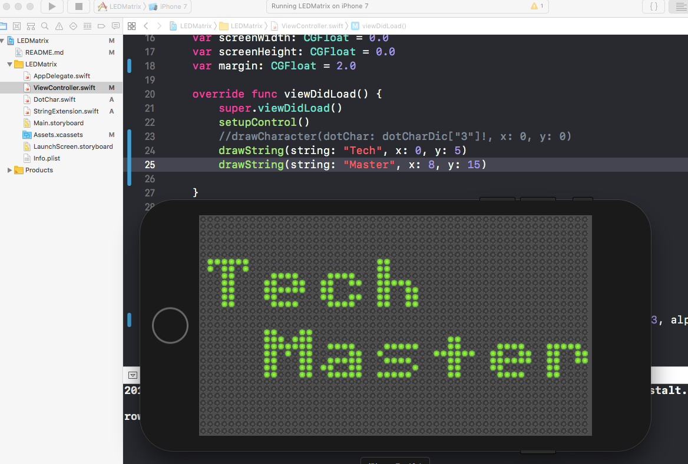

#  Giả lập bảng đèn LED chữ chạy

Hãy lập trình bảng đèn LED chữ chạy


**Các bước lập trình**

1. Xác định số hàng và cột phù hợp để vẽ (đặt) các bóng đèn LED
2. Vẽ mã trận các bóng đèn LED nhớ đánh dấu chúng bằng thuộc tính UIView.tag sau này để lấy ra được
3. Bật tắt bóng đèn LED tại tọa độ (x, y)
4. Phân tích cấu trúc dữ liệu của bảng ký tự mã trận thường là 8x8
5. Thử dịch ngược, thủ công và vẽ lại điểm ảnh của một ký tự. Nếu vẽ lại được thì tự động hóa bằng hàm
6. Vẽ một ký tự dot matrix
7. Vẽ một chuỗi ký tự
8. Cho chuỗi ký tự chạy trên màn hình


[Bảng ký tự dot matrix](https://xantorohara.github.io/led-matrix-editor)
```
Ký tự N
**000**0
**000**0
***00**0
****0**0
**0****0
**00***0
**000**0
00000000

đọc từ hàng dưới lên hàng trên
trong 1 hàng phải từ ký tự phải qua trái
00000000
0**000**
0***00**
0****0**
0**0****
```
