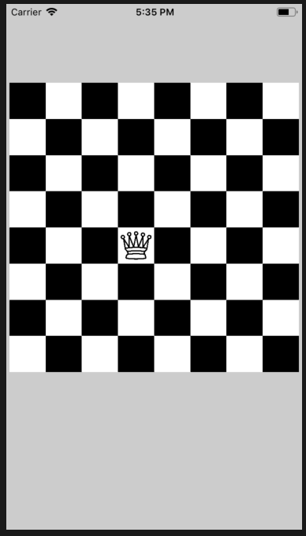

#  Vẽ hình bàn cờ, cùng 8 quân hậu

Hãy vẽ bàn cờ quốc tế 8 hàng ngang, 8 hàng dọc



## Bài tập mở rộng


**Di chuyển theo hình ô vuông**

Hãy di chuyển quân hậu theo hình ô vuông, lần 1 theo chiều kim đồng hồ, lần 2 chạy ngược chiều kim đồng hồ
```
+------------->
^             |
|             |
|             |
|             |
|             |
|             |
<-------------v
```

Hãy di chuyển quân hậu theo hình cánh bướm
```
*           *
* *       * *
*   *   *   *
*     *     *
*   *   *   *
* *       * *
*           *
```
**Hiển thị tất cả các đáp án của bài toán 8 quân hậu**


